# TODO: Reclame Aqui — Data Analysis

---

## 🎯 CURRENT FOCUS: Nagem Single-Company Analysis

We are refocusing the analysis to **only analyze Nagem** for now (map to be added later).

### Plan for Nagem-Focused Analysis

**Approach:** Modify the existing `exploratory_analysis.ipynb` to:
1. Load only `RECLAMEAQUI_NAGEM.csv` (1000 rows, 2017–2022)
2. Remove multi-company logic (no `EMPRESA` column needed)
3. Perform deep single-company EDA following project requirements

### Tasks (Nagem Focus)

#### Phase 1 — Data Loading & Cleaning (Nagem Only)
- [x] Load `RECLAMEAQUI_NAGEM.csv` only (remove other company files)
- [x] Confirm shape: ~1000 rows, date range 2017–2022
- [x] Strip whitespace from `ID` column
- [x] Parse `TEMPO` as datetime
- [x] Extract `ESTADO` from `LOCAL` (handle malformed values)
- [x] Extract primary category from `CATEGORIA` (split on `<->`)
- [x] Add derived columns: `TAMANHO_DESCRICAO`, `RESOLVIDO`

#### Phase 2 — Descriptive Statistics & Seasonality (Nagem)
- [x] Univariate: STATUS distribution, ESTADO distribution, ANO/MES distribution
- [x] Text length statistics: min, max, mean, median, std of `TAMANHO_DESCRICAO`
- [x] Seasonality: MES, DIA_DA_SEMANA, TRIMETRES, SEMANA_DO_ANO
- [x] Cross-referencing: STATUS × CATEGORIA, STATUS × ESTADO, STATUS × text size

#### Phase 3 — Dashboard Charts (No Map for Now)
- [x] Time series + moving average (complaints over time)
- [x] Pareto chart by ESTADO
- [x] STATUS proportion chart (pie/bar)
- [x] Text length boxplot grouped by STATUS
- [x] WordCloud with NLP stopword removal

#### Phase 4 — Dashboard Implementation
- [x] Global filters: Estado, Status, Tamanho da Descrição (range)
- [x] Wire charts to filters
- [x] **MAP IMPLEMENTED** — TopoJSON choropleth (~14KB, RAM-efficient)
- [ ] Deploy to Streamlit Community Cloud or Render

### ✅ Completed Refactoring
- [x] Notebook refactored for Nagem-only analysis
- [x] Dashboard refactored for Nagem-only (map placeholder added)
- [x] Multi-company structure preserved for future expansion

### ✅ City-Level Analysis Added (Section 5.5)
- [x] **Extract CIDADE** from LOCAL column
- [x] **Classify Capital vs Interior** using official capitals list
- [x] **Top 20 cities** bar chart (color-coded by type)
- [x] **Capital vs Interior comparison** (volume, resolution rate, text size)
- [x] **Interior-only analysis** (top interior cities, resolution rates)
- [x] **STATUS distribution heatmap** (Capital vs Interior)
- [x] **Map: % Interior per state** (choropleth showing interior concentration)

### ✅ Advanced Analysis Added (Sections 9-14)
- [x] **Section 9 — Análise Avançada de Distribuições**
  - Histograma com KDE, Q-Q plot (normalidade), violin plots
  - Identificação de outliers (método IQR)
  - Distribuição de CASOS com scatter plots
- [x] **Section 10 — Decomposição de Série Temporal**
  - Decomposição em tendência + sazonalidade + resíduos (statsmodels)
  - Análise de tendência por ano
- [x] **Section 11 — Análise de Taxa de Resolução**
  - Taxa por faixas de tamanho da descrição
  - Taxa por dia da semana
  - Taxa por categoria (top 10)
- [x] **Section 12 — Análise de Correlação**
  - Matriz de correlação (heatmap)
  - Pair plot colorido por STATUS
- [x] **Section 13 — Testes Estatísticos**
  - Kruskal-Wallis (diferença de tamanho por STATUS)
  - Mann-Whitney U (Resolvido vs Não Resolvido)
  - Chi-quadrado (associação ESTADO × STATUS)
- [x] **Section 14 — Resumo dos Principais Achados**
  - Consolidação executiva de todas as descobertas

---

## Requirements Graph

```mermaid
flowchart TD
    RAW[(6 Raw CSV Files)]

    subgraph P1["Phase 1 — Data Cleaning & Processing"]
        P1A[1.1 Load & Inspect]
        P1B[1.2 Fix Data Quality Issues\nwhitespace · dates · LOCAL · CATEGORIA · STATUS types]
        P1C[1.3 Add Derived Columns\nEMPRESA · TAMANHO_DESCRICAO · RESOLVIDO · combined DF]
        P1A --> P1B --> P1C
    end

    subgraph P2["Phase 2 — Descriptive Stats & EDA"]
        P2A[2.1 Univariate Analysis\nSTATUS · ESTADO · ANO/MES · text length]
        P2B[2.2 Seasonality Analysis\nmonth · weekday · quarter · week of year]
        P2C[2.3 Cross-referencing\nSTATUS × CATEGORIA · ESTADO · text size · CASOS]
        P2A --> P2B --> P2C
    end

    subgraph P3["Phase 3 — Dashboard Charts & Metrics"]
        P3A[3.1 Time Series + Moving Average]
        P3B[3.2 Choropleth Map of Brazil + year slider]
        P3C[3.3 Pareto Chart by State]
        P3D[3.4 STATUS Proportion Chart]
        P3E[3.5 Text Length Boxplot × STATUS]
        P3F[3.6 WordCloud with NLP stopword removal]
    end

    subgraph P4["Phase 4 — Dashboard Implementation & Deploy"]
        P4A[Global Filters\nEstado · Status · Tamanho da Descrição]
        P4B[Wire all 6 charts to filters]
        P4C[Deploy online\nStreamlit Cloud or Render]
        P4A --> P4B --> P4C
    end

    subgraph P5["Phase 5 — Final Submission"]
        P5A[Organize Notebook\nmulti-cell · imports · loading · cleaning · EDA · charts]
        P5B[Push to GitHub\nnotebook + dashboard code]
        P5C[Record Video\nmax 10 min · min 3 narrators]
        P5D[Compile PDF with all links\nsubmit on VLE]
        P5A --> P5B
        P5C --> P5D
        P5B --> P5D
    end

    RAW --> P1A
    P1C --> P2A
    P1C --> P3A & P3B & P3C & P3D & P3E & P3F
    P2C --> P3A & P3B & P3C & P3D & P3E & P3F
    P3A & P3B & P3C & P3D & P3E & P3F --> P4A
    P4C --> P5A
    P2C --> P5A
    P5D --> DONE([Delivered])
```

---

## Datasets Overview
| File | Rows | Years |
|---|---|---|
| RECLAMEAQUI_BIGLOJAS.csv | 1000 | 2021–2022 |
| RECLAMEAQUI_CARREFUOR.csv | 1000 | 2022 |
| RECLAMEAQUI_HAPVIDA.csv | 1016 | 2022 |
| RECLAMEAQUI_IBYTE.csv | 1000 | 2016–2022 |
| RECLAMEAQUI_NAGEM.csv | 1000 | 2017–2022 |
| RECLAMEAQUI_PAODEACUCAR.csv | 1000 | 2022 |

**STATUS values (all files):** Resolvido, Não resolvido, Respondida, Não respondida, Em réplica
**Columns:** ID, TEMA, LOCAL, TEMPO, CATEGORIA, STATUS, DESCRICAO, URL, ANO, MES, DIA, DIA_DO_ANO, SEMANA_DO_ANO, DIA_DA_SEMANA, TRIMETRES, CASOS

---

## Phase 1 — Data Cleaning & Processing

### 1.1 Load & Inspect
- [x] Load all 6 CSVs into pandas DataFrames (one per company or combined with a `EMPRESA` column)
- [x] Confirm shape, dtypes, and column names for each file
- [x] Display `.info()` and `.describe()` for initial overview

### 1.2 Fix Known Data Quality Issues
- [x] Strip leading/trailing whitespace from `ID` column (affects all 1000+ rows in every file)
- [x] Parse `TEMPO` column as `datetime` (currently a string like `2022-01-08`)
- [x] Extract `ESTADO` from `LOCAL` column by splitting on ` - ` (format: `"City - STATE"`)
- [x] Handle malformed `LOCAL` values where state is `--` or separator is missing (label as `Desconhecido`)
- [x] Split `CATEGORIA` column on `<->` separator to extract the primary/first category
- [x] Standardize `STATUS` text (strip whitespace, confirm consistent values across all files)
- [x] Convert `ANO`, `MES`, `DIA`, `CASOS` to correct numeric types (int)
- [x] Verify `DIA_DA_SEMANA`, `SEMANA_DO_ANO`, `DIA_DO_ANO`, `TRIMETRES` are numeric

### 1.3 Add Derived Columns
- [x] Add `EMPRESA` column to each DataFrame before concatenating (based on filename)
- [x] Add `TAMANHO_DESCRICAO` column: character count of `DESCRICAO`
- [x] Add `RESOLVIDO` boolean column: `True` if STATUS == "Resolvido"
- [x] Create a combined DataFrame with all 6 companies for cross-company analysis

---

## Phase 2 — Descriptive Statistics & Seasonality

### 2.1 Univariate Analysis
- [x] Distribution of STATUS across all companies (counts and %)
- [x] Distribution of complaints by `ESTADO` (top 10 states)
- [x] Distribution of complaints by `ANO` and `MES` (seasonality)
- [x] Distribution of `TAMANHO_DESCRICAO` (min, max, mean, median, std)

### 2.2 Seasonality Analysis
- [x] Complaints by `MES` — is there a peak month?
- [x] Complaints by `DIA_DA_SEMANA` — are there more on weekdays vs weekends?
- [x] Complaints by `TRIMETRES` (quarters) — seasonal patterns per quarter
- [ ] Complaints by `SEMANA_DO_ANO` — weekly trend over the year

### 2.3 Cross-referencing
- [x] STATUS vs CATEGORIA — which categories have the worst resolution rates?
- [x] STATUS vs ESTADO — which states have the worst resolution rates?
- [x] STATUS vs TAMANHO_DESCRICAO — do longer complaints get resolved more?
- [x] CASOS vs STATUS — do high-case complaints get resolved more?

---

## Phase 3 — Dashboard Metrics & Charts

### 3.1 Time Series
- [x] Plot number of complaints over time (daily or monthly)
- [x] Add 7-day or 30-day moving average line to the time series

### 3.2 Geographic Analysis
- [x] Count complaints per `ESTADO`
- [x] Build choropleth map of Brazil showing complaint density by state
- [x] Add year slider to filter the map by `ANO`

### 3.3 Spatial Distribution
- [x] Build Pareto chart: complaint count by state (sorted descending, with cumulative % line)

### 3.4 Resolution Proportion
- [x] Pie or bar chart of complaint counts by STATUS
- [x] Optionally broken down per company

### 3.5 Text Length Analysis
- [x] Boxplot or histogram of `TAMANHO_DESCRICAO` distribution
- [x] Cross-reference: `TAMANHO_DESCRICAO` grouped by STATUS (box per status group)

### 3.6 WordCloud / NLP
- [x] Concatenate all `DESCRICAO` text
- [x] Tokenize and remove Portuguese stopwords (use `nltk` with `stopwords` corpus)
- [x] Remove additional noise words (company names, punctuation, numbers)
- [x] Generate WordCloud image from remaining tokens

---

## Phase 4 — Dashboard Implementation (Streamlit or Plotly Dash)

- [x] Implement global sidebar filters: Estado, Status, Tamanho da Descrição (range slider)
- [x] Wire all 6 charts to respond to the global filters
- [x] Add year slider specifically to the choropleth map
- [x] Test all chart interactions locally
- [ ] Deploy to Streamlit Community Cloud or Render
- [ ] Confirm the deployed URL is publicly accessible

---

## Phase 5 — Final Submission
- [x] Clean and organize the Jupyter/Colab notebook (separate cells per phase)
- [ ] Push notebook and dashboard source code to GitHub
- [ ] Record explanatory video (max 10 min, min 3 narrators)
- [ ] Compile all links (notebook, repo, dashboard, video) into a single PDF
- [ ] Each team member submits the PDF on the VLE
